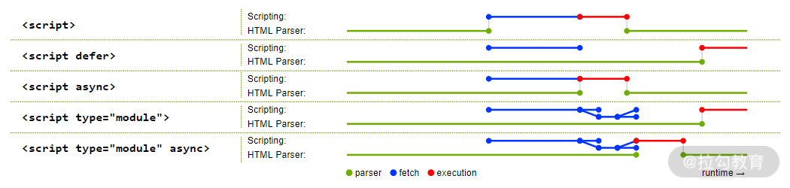
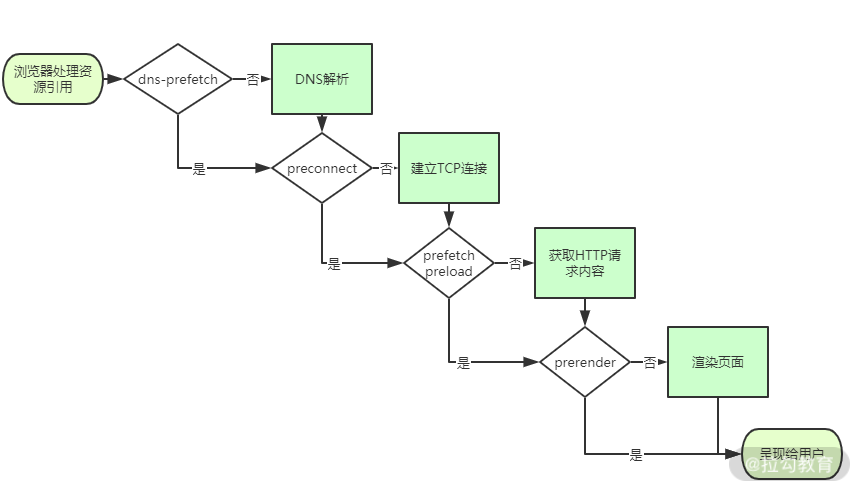

# 看不见的标签

## 交互实现
- meta标签:自动刷新/跳转
  + ```<meta http-equiv="Refresh" content="5; URL=page2.html">```
    - 5秒后跳转到 page2.html
  + ```<meta http-equiv="Refresh" content="60">```
    - 60秒自刷新  
- title 标签与 Hack 手段
  + 设置document.title的值，详情见index.html。
	
## 性能优化
- script标签：调整加载顺序提升渲染速度
  + async 属性。立即请求文件，但不阻塞渲染引擎，而是文件加载完毕后阻塞渲染引擎并立即执行文件内容
  + defer 属性。立即请求文件，但不阻塞渲染引擎，等到解析完 HTML 之后再执行文件内容
  + HTML5 标准 type 属性，对应值为“module”。让浏览器按照 ECMA Script 6 标准将文件当作模块进行解析，默认阻塞效果同 defer，也可以配合 async 在请求完成后立即执行
  + 请求时间图
    - 绿色的线表示执行解析 HTML ，蓝色的线表示请求文件，红色的线表示执行文件。
- link标签：通过预处理提升渲染速度
	+ dns-prefetch。当 link 标签的 rel 属性值为“dns-prefetch”时，浏览器会对某个域名预先进行 DNS 解析并缓存。这样，当浏览器在请求同域名资源的时候，能省去从域名查询 IP 的过程，从而减少时间损耗。
	+ preconnect。让浏览器在一个 HTTP 请求正式发给服务器前预先执行一些操作，这包括 DNS 解析、TLS 协商、TCP 握手，通过消除往返延迟来为用户节省时间。
	+ prefetch/preload。两个值都是让浏览器预先下载并缓存某个资源，但不同的是，prefetch 可能会在浏览器忙时被忽略，而 preload 则是一定会被预先下载。
	+ prerender。浏览器不仅会加载资源，还会解析执行页面，进行预渲染。
  + link请求资源流程图  

## 搜索优化
- meta标签：提取关键信息
	+ 通过 meta 标签可以设置页面的描述信息，从而让搜索引擎更好地展示搜索结果。
		- ```<meta content="拉勾,拉勾网,拉勾招聘,拉钩, 拉钩网 ,互联网招聘,拉勾互联网招聘, 移动互联网招聘, 垂直互联网招聘, 微信招聘, 微博招聘, 拉勾官网, 拉勾百科,跳槽, 高薪职位, 互联网圈子, IT招聘, 职场招聘, 猎头招聘,O2O招聘, LBS招聘, 社交招聘, 校园招聘, 校招,社会招聘,社招" name="keywords"> ```
- link 标签：减少重复
  + 有时候为了用户访问方便或者出于历史原因，对于同一个页面会有多个网址，又或者存在某些重定向页面，
	```<link href="https://xx.com/a.html" rel="canonical"> ```
	这样可以让搜索引擎避免花费时间抓取重复网页。

## 延伸内容：OGP（开放图片协议）